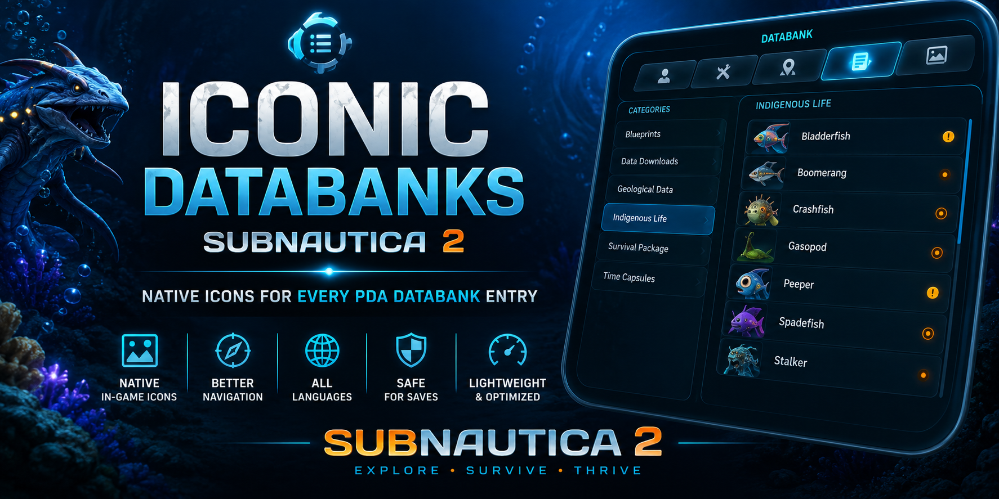

# Iconic-Databanks-Subnautica-2
Adds native in-game icons to every PDA Databank entry in Subnautica 2. Clean, immersive, language-independent UI enhancement

# Iconic Databanks - Subnautica 2

  

<h1 align="center">Iconic Databanks</h1>

  Give every PDA Databank entry its own native in-game icon.

  
  
  
  

---

## Overview

The vanilla PDA Databank displays text-only entries, making long lists difficult to browse.

Iconic Databanks adds the real in-game icon beside every Databank entry, allowing faster navigation and a more immersive experience.

---

## Features

### Native Game Icons

* Real in-game textures
* Consistent visual style
* Seamless integration

### Better Navigation

* Faster category recognition
* Easier browsing
* Improved readability

### Language Independent

Works with all supported game languages.

### Safe Installation

* No save edits
* No save corruption
* Lightweight implementation

---

## Screenshots

### Databank Overview

### Icon Preview

---

## Requirements

* Subnautica 2
* UE4SS

---

## Installation

1. Install UE4SS.
2. Download the latest release.
3. Extract files into the correct game folders.
4. Launch the game.
5. Open PDA → Databank.

---

## Compatibility

* English
* German
* French
* Italian
* Spanish
* Portuguese
* Japanese
* Korean
* Chinese

---

## FAQ

### Does this affect saves?

No.

### Does this impact performance?

No noticeable impact.

### Does it work with translations?

Yes.

---

## License

MIT License
